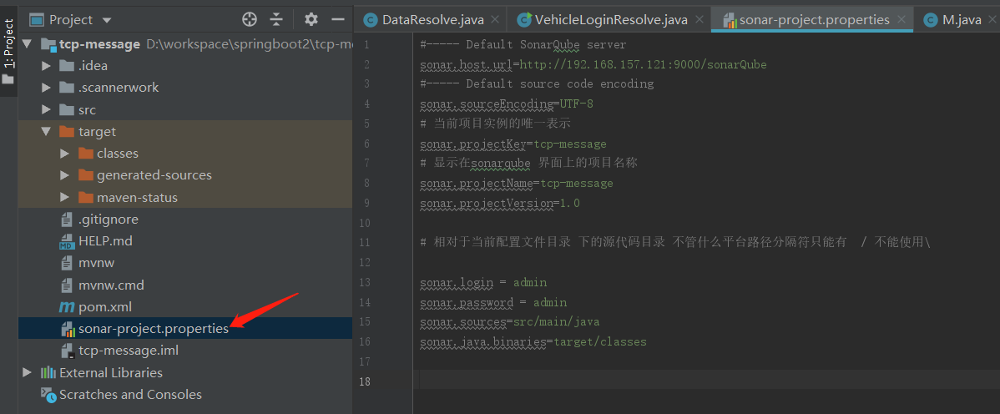

#  sonar的环境搭建

## 1 centos7上安装mysql5.7

### 1.下载YUM源

### （http://dev.mysql.com/downloads/repo/yum/

```shell
wget http://dev.mysql.com/get/mysql57-community-release-el7-8.noarch.rpm
```

### 2.安装mysql源

```shell
yum localinstall mysql57-community-release-el7-8.noarch.rpm
```

### 3.检查mysql源是否安装成功

```shell
yum repolist enabled | grep "mysql.*-community.*"
```


### 4 安装MySQL

```shell
yum install mysql-community-server
```

### 5.启动Mysql服务

```shell
systemctl start mysqld
```

- 根据自己需求是否设置开机自启动

- ```SHELL
  systemctl enable mysqld
  systemctl daemon-reload
  ```

### 6.修改root本地登录密码，

mysql安装完成之后，在/var/log/mysqld.log文件中给root生成了一个默认密码。通过下面的方式找到root默认密码，然后登录mysql进行修改：

```
grep 'temporary password' /var/log/mysqld.log
```


   ```shell
  mysql -u root –p
   ```

```mysql
ALTER USER 'root'@'localhost' IDENTIFIED BY '123456';
```


发现报了一个错误 ：mysql5.7默认安装了密码安全检查插件（validate_password），默认密码检查策略要求密码必须包含：  大小写字母、数字和特殊符号，并且长度不能少于8位。修改策略之后再执行修改密码

解决方式如下:

执行两条命令:

```mysql
set global validate_password_policy=0;
set global validate_password_policy=LOW;
```


**另外开起mysql对外访问权限，允许远程连接：**

```mysql
mysql> use mysql;
Database changed
mysql> select host,user,password from user;
+--------------+------+-------------------------------------------+
| host         | user | password                                  |
+--------------+------+-------------------------------------------+
| localhost    | root | *A731AEBFB621E354CD41BAF207D884A609E81F5E |
| 192.168.1.1 | root | *A731AEBFB621E354CD41BAF207D884A609E81F5E |
+--------------+------+-------------------------------------------+
2 rows in set (0.00 sec)

mysql> use mysql;
Database changed
mysql> grant all privileges  on *.* to root@'%' identified by "123456";
Query OK, 0 rows affected (0.00 sec)

mysql> flush privileges;
Query OK, 0 rows affected (0.00 sec)

mysql> select host,user,password from user;
+--------------+------+-------------------------------------------+
| host         | user | password                                  |
+--------------+------+-------------------------------------------+
| localhost    | root | *A731AEBFB621E354CD41BAF207D884A609E81F5E |
| 192.168.1.1 | root | *A731AEBFB621E354CD41BAF207D884A609E81F5E |
| %            | root | *A731AEBFB621E354CD41BAF207D884A609E81F5E |
+--------------+------+-------------------------------------------+
3 rows in set (0.00 sec)
```


### 7.Sonar要求mysql必须是InnoDB存储引擎

- 查看mysql目前是什么存储引擎

- 如果不是InnoDB，设置为InnoDB，修改配置文件/etc/my.cnf

  ```shell
  mysql  -u root –p	先登录mysql
  show engines;		查看mysql目前提供的存储引擎
  ```
  
  ```
  vi /etc/my.cnf
  [mysqld]
  default-storage-engine=INNODB
  ```

  重启mysql数据库，再次登录查看默认存储引擎设置是否生效

  

### 8.设置mysql缓存参数

- a 设置innodb_buffer_pool_size,参数值设置尽可能大一些，这个参数主要是缓存InnoDB表的索引，数据，插入数据时的缓冲，默认值：128M，我们这里设置为256M

- b 设置mysql的查询缓存quert_cache_size的开关为1，然后设置最少15M，重启mysql数据库

  ```
  vi /etc/my.cnf
  ```

  > [mysqld]
  >
  >   innodb_buffer_pool_size = 256M
  >
  >   query_cache_type=1
  >
  >   query_cache_size=32M

  


## 2 centos7虚拟机上安装mysql5.7

### 1.在mysql中新建一个sonarQube数据库

（UTF-8编码）

```mysql
CREATE DATABASE sonarQube  CHARACTER SET utf8 COLLATE utf8_general_ci;
```


### 2.从官网下载LTS版本的sonarQuba安装包

（sonarqube-6.7.6.zip）

> 注意下最新的 7.9.1的 必须使用jdk11.我使用的是jdk8所以选择这个版本

#### a linux命令行下执行下载：

```
wget https://binaries.sonarsource.com/Distribution/sonarqube/sonarqube-6.7.6.zip
```

#### b 解压安装并更名

```
unzip sonarqube-6.7.6.zip
```

```
mv sonarqube-6.7.6/ sonarqube
```


> 之前介绍组成的时候说sonarqube是sonar的服务端，相当于一个web服务器，用来发布应用，在线浏览、配置分析等。怎么样？有没有很面熟的感觉？是不是有点像tomcat呢？
>
> bin：sonarqube运行命令文件夹    
>
> conf：sonarqube配置文件夹    
>
> data：嵌入式数据库的数据（H2数据库引擎），建议只用于测试和演示   
>
> elasticsearch：搜索引擎
>
> extensions：sonarqube的插件等存放文件夹    
>
> lib：sonarqube存放的运行库文件夹（jar）    
>
> logs：sonarqube日志文件夹   
>
> temp：sonarqube临时文件夹   
>
> web：sonarqube系统UI界面文件夹

### 3 编辑sonar配置

```shell
cd sonarQube/conf/
```

```shell
vi sonar.properties
```

- Mysql数据用户名

> sonar.jdbc.username=root
>
> sonar.jdbc.password=123456

- 配置mysql数据库

> sonar.jdbc.url=jdbc:mysql://localhost:3306/sonarQube?useUnicode=true&characterEncoding=UTF-8

- 设置sonar服务

> sonar.web.host=0.0.0.0
>
> sonar.web.context=/sonarQube
>
> sonar.web.port=9000


### 4.启动sonarQubeweb service

第一次启动会自动在数据库生成所需的表，可进入数据库查看下


### 5.坑

- 1.由于6.6版本加入了elasticsearch，不能以root用户启动，因为安全问题elasticsearch 

不让用root用户直接运行，所以要创建新用户，用新用户启动

> //创建esuser用户
>
>   //目录组和用户都是esuser
>
>   //sonarqube文件设置777
>    //编写配置文件
>
>  \# useradd sonarUser
>
>  passwd sonarUser 
>
>  输入2次密码
>
>  \#chown -R sonarUser:sonarUser sonarqube
>
>  \# chmod 777 -R sonarqube
>
>  \# vi  /opt/mod/sonarQube/elasticsearch/config/elasticsearch.yml 


- 2.4096

  如果启动中出现错误：如：

  max file descriptors [4096] for elasticsearch process likely too low, increase to at least [65536]

  max virtual memory areas vm.max_map_count [65530] likely too low, increase to at least [262144]

>   解决65536：
切换到root用户，进入limits.d目录下修改配置文件。

    vi /etc/security/limits.conf 

 添加如下内容:

```v 
 * soft nofile 65536

 * hard nofile 131072

 * soft nproc 2048

 * hard nproc 4096 
```

>  解决262144：
>
> 切换到root用户修改配置sysctl.conf 


```
 vi /etc/sysctl.conf 
```

添加下面配置：

>  vm.max_map_count=655360

  并执行命令：

>  sysctl    –p

- 修改java的jdk为自己的配置地址（自己测试出来的，别人好像没有这个弄过）

  

### 6.Sonarweb下载汉化包


## 3.使用SonarQubeScanner分析代码
- 1. 从官网下载scanner对应的版本后直接解压

<https://docs.sonarqube.org/latest/analysis/scan/sonarscanner/>


- 2.通过编辑xxxx/conf/sonar-scanner.properties更新全局设置以指向SonarQube服务器

  ```shell
  sonar.host.url = http://192.168.157.121:9000/sonarQube
  ```


- 3.将xxxx/bin设置到环境变量PATH中

  

- 4.在命令行输入sonar-scanner –h，验证安装结果[1564841943393](C:\Users\lenovo\Desktop\sonar\assets\1564841943393.png)

  

- 5 在需要分析的项目根目录中创建配置文件：sonar-project.properties




- 6.从需要分析的项目根目录运行以下命令以启动分析，出现执行EXECUTION SUCCESS表示成功.

  ```SHELL
  sonar-scanner
  ```

- 

- 7.登录sonarQubeWeb查看结果
  

## 4.使用maven插件分析代码

### 方式1:

- 1.在本地配置maven的setting文件

  ```xml
   <profile>
              <id>sonar</id>
              <activation>
                  <activeByDefault>true</activeByDefault>
              </activation>
              <properties>
                               <sonar.host.url>http://192.168.157.121:9000/sonarQube</sonar.host.url>
              </properties>
          </profile>
  ```


- 2.在项目根目录下执行CMD命令:

  ```
  mvn sonar:sonar
  ```

  

- 3.登录sonarQubeWeb查看结果

  

### 方式2(比较灵活)：

- 直接执行命令

  ```shell
  mvn sonar:sonar  -Dsonar.projectKey=tcp-message   -Dsonar.host.url=http://192.168.157.121:9000/sonarQube  -Dsonar.login=6819ef02cc40d783580fa7627bea3ebc5ff0e461
  
  ```

  

